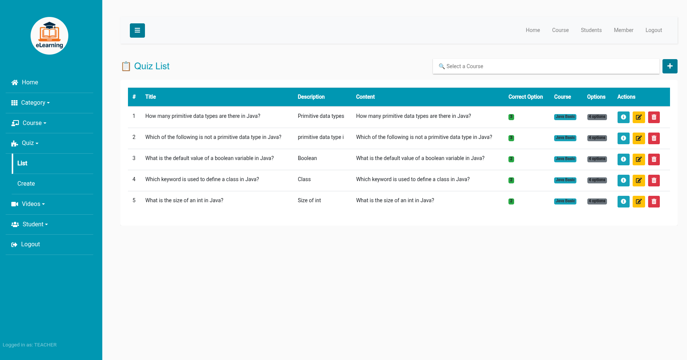
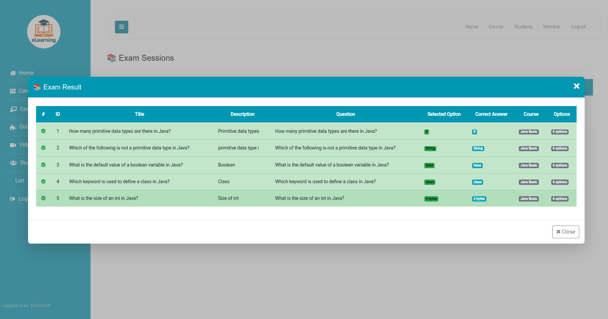
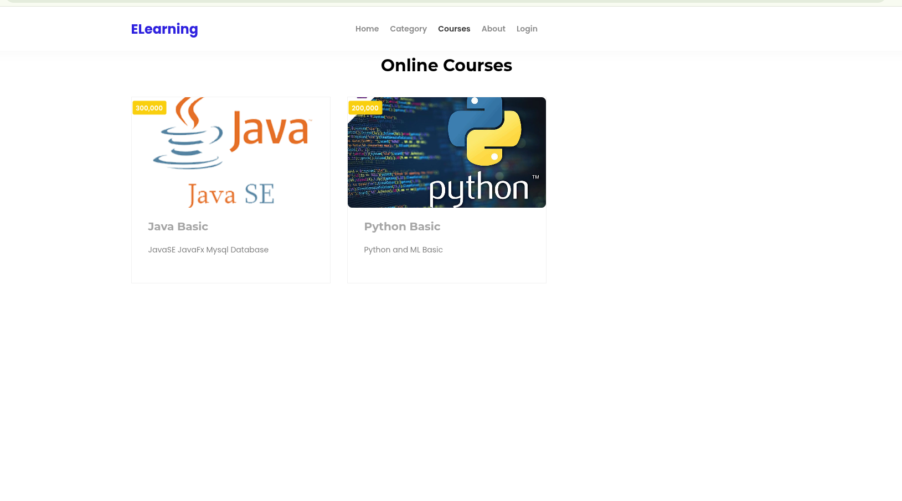
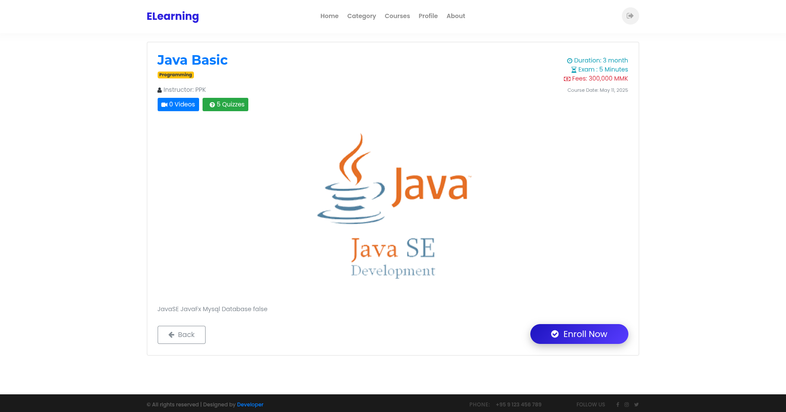
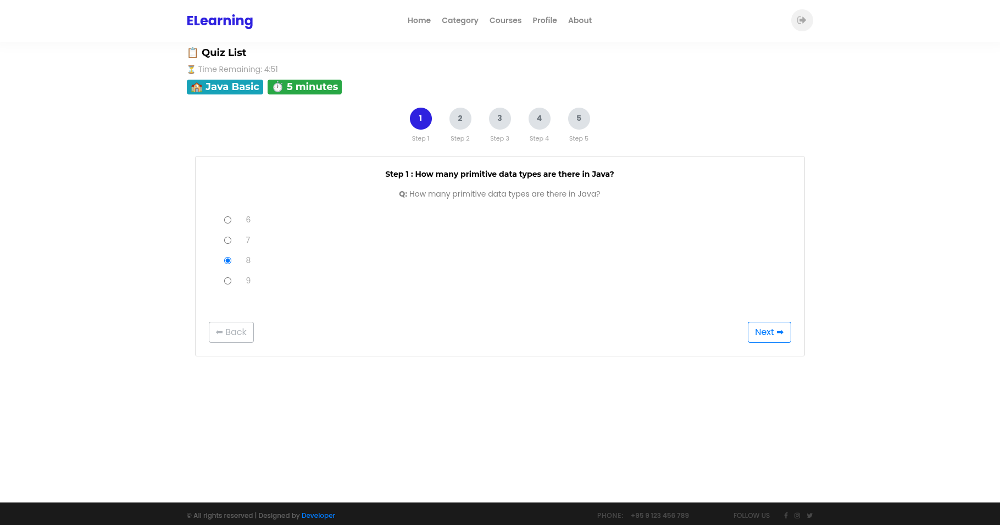
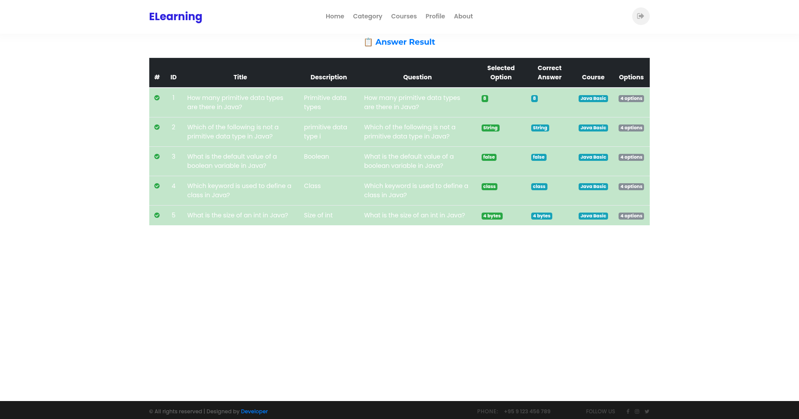

# Course Management System – Dockerized

This project is a containerized Course Management System built with Spring Boot (backend), Angular (frontend), and MySQL. It includes two separate modules for **Admin** and **Client**.

## 🧱 Architecture Overview

- **MySQL** – Relational database for storing course and user data.
- **Admin Backend** – Spring Boot application for admin-side operations.
- **Client Backend** – Spring Boot application for client-side operations.
- **Admin Frontend** – Angular-based frontend for administrators.
- **Client Frontend** – Angular-based frontend for users.

---

## 🚀 Quick Start

### Prerequisites

- Docker
- Docker Compose

### Steps to Run

1. Development:

   ```bash
   git clone https://github.com/yourusername/course-management-docker.git
   cd course-management-docker
   docker-compose up --build

2. Production:

   ```bash
   git clone https://github.com/yourusername/course-management-docker.git
   cd course-management-docker
   docker-compose -f docker-compose.yml -f docker-compose.prod.yml up --build -d


## 📸 Screenshots

### 🧑‍💼 Admin Dashboard


---

### 📝 Admin Quiz Management


---
### 📋 Admin Exam Management



---
### 📋 Admin Exam Result




---

### 🎓 Client Course List



---

### 📥 Enroll in a Course



### 🎓 Client Exam



---

### 📈 Client Result



---